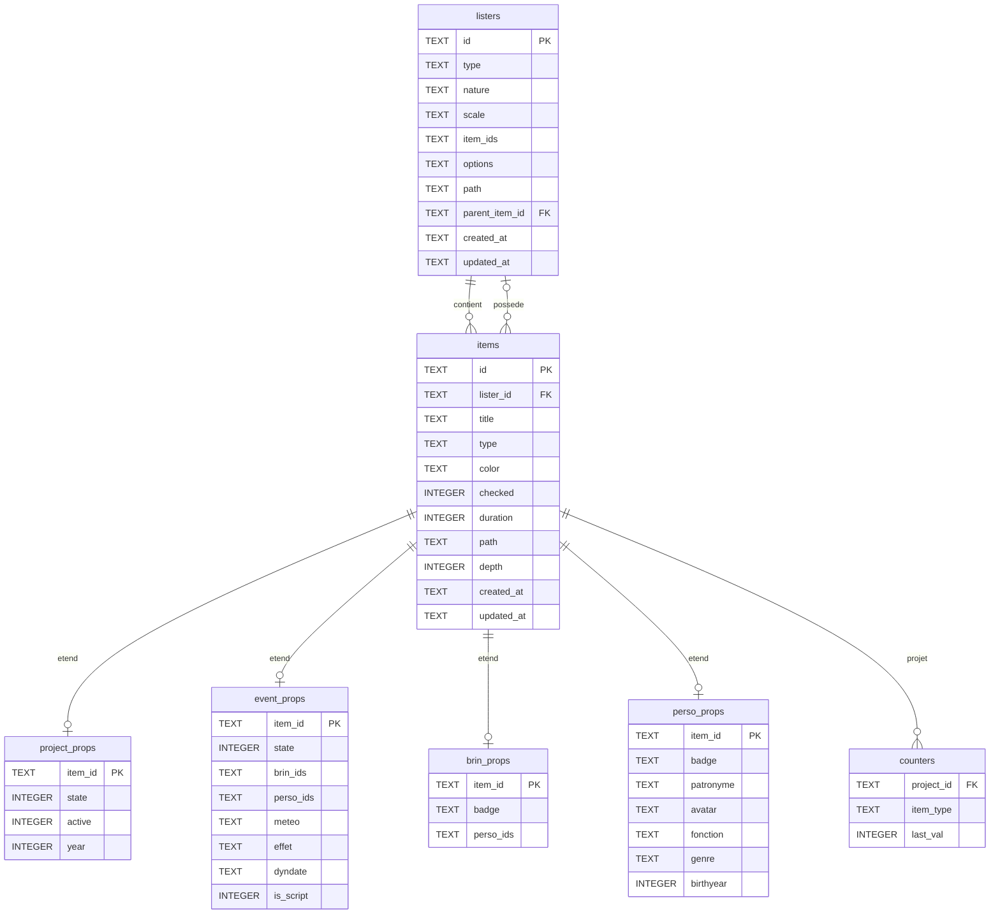

# Schéma SQLite — Eventer3

## Tables

---

## Notes

### `items.lister_id` remplace `has_lister`
Un item possède un lister si et seulement si il existe un enregistrement dans `listers` avec `parent_item_id = item.id`. La colonne `has_lister` est redondante et supprimée.

### `items.type`
La colonne `type` est commune à tous les items. Elle est interprétée différemment selon la classe spécialisée :
- **Event** : `dia` / `act` / `des`
- **Brin** : `mint` / `aint` / … (BrinTypes)
- **Perso** : `p` / `a` / `b` (protagoniste / antagoniste / ambivalent)
- **Project** : `scenario` / `roman`

### `items.depth`
Valeur dénormalisée pour accélérer les requêtes de vue par niveau.  
**À mettre à jour** lors de tout déplacement d'un item vers un autre lister.

### `counters` remplace `lasts_id`
SQLite ne génère pas nativement des IDs avec préfixe. La table `counters` stocke le dernier indice utilisé par type d'item et par projet. Lors de la création d'un brin dans le projet `mon-projet` : on incrémente `counters(mon-projet, brin)` et on préfixe avec `b` → `b3`.

### Persos d'un Event
Les personnages d'un event sont l'union de :
- `brin_props.perso_ids` pour chaque brin dans `event_props.brin_ids`
- `event_props.perso_ids` (persos directs, hors brins)

Des doublons sont possibles et gérés à l'affichage.
