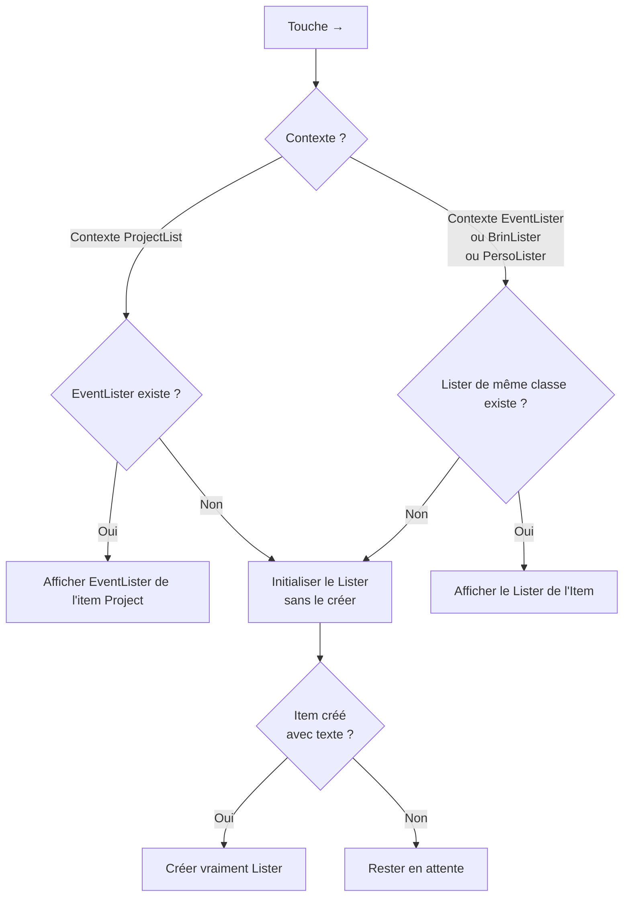

# Eventer(3)

[TOC]

---

## Description

Eventer est une application qui permet de gérer les **évènemenciers** de projets de film ou de roman. 

### Qu’est-ce un « évènemencier » ?

Un *évènemencier* est une suite d’évènements au sens anglo-saxon du terme, c’est-à-dire au sens de « quelque chose qui se passe » d’importance quelconque. Une action (*remplir un verre d’eau*) est un évènement, un dialogue est un évènement, un morceau de ce dialogue est un évènement, une séquence (*suivre une journée de cours*) est un évènement.

Un évènement a une échelle déterminé (`scale`). Par exemple, l’échelle d’un évènemencier de premier niveau est l’acte. Donc **chaque acte est un évènement** (de longue durée).

---

## Specs

### `Lister` et `Item`

`Lister` et `Item` sont à la base de tout dans l’application. Il suffit de bien décrire leur comportement pour gérer l’ensemble des types d’éléments, *projets*, *évènemenciers*, *brins* et *personnages* (pour le moment). Mais ce sont **des classes abstraites** dont vont hériter les autres classes.

IL EST CAPITALE DE BIEN COMPRENDRE CE QUI EST DIT CI-DESSUS, que **`Lister`** et **`Item`** sont ***le cœur*** et que tout le reste n'est que classes spécialisées.

* La *liste des projets* (`ProjectLister`) affichée au lancement de l’application est une classe spécialisée de `Lister` (`ProjectLister`) qui affiche les projets au départ.

  Chaque projet (`Project`) est une classe spécialisée de `Item` pour gérer chaque projet individuellement.

* Les évènemenciers (`EventLister`) est une classe spécialisée de `Lister` qui gère les évènemenciers (imbriqués ou non)

  Chaque évènemencier (`Event`) est une classe spécialisée de `Item` pour gérer chaque évènement (event).

* Les brins (`BrinLister`) est une classe spécialisée de `Lister` qui gère les brins (brins-groupe ou brins seuls)

  Chaque brin seul (ou brin-groupe) (`Brin`) est une classe spécialisée de `Item` pour gérer chaque brin.

* Les personnages (`PersoLister`) est une classe spécialisée de `Lister` qui gère les personnages (personnages-groupe ? ou personnages seuls)

  Chaque personnage seul (ou personnage-groupe ?) (`Brin`) est une classe spécialisée de `Item` pour gérer chaque personnage.

> Les brins-groupe et les personnages-groupe viennent simplement du fait que puisque toutes les listes peuvent être imbriquées, on peut avoir des imbrications aussi dans les brins et les personnages. Un brin ne serait pas un brin mais possèderait un lister de brins, donc deviendrait un « brin-groupe », par exemple le brin-groupe « Personnages » qui s’occuperait de chaque personnage — attention la confusion ici : aucun rapport entre ces personnages et les personnages de `PersoLister`).
>
> C’est plus difficile de l’imaginer pour les personnages, même si on pourrait très bien avoir un personnage-groupe « Protagonistes » avec tous les personnages qui aident le protagoniste, un personnage-groupe « Antagonistes » avec les antagonistes et un personnage-groupe « Ambivalents » avec ceux qui sont adjuvants et antagonistes.

TODO : Définir l’affichage propre à chaque type d’élément (note : c’est déjà fait dans le programme avec les projets).

##### Affichage

Sur une ligne

à gauche : `title` 

à droite : `badge`s des brins + `badge`s des persos à droite + menu `state`

#### Les brins

`BrinLister` < `Lister`

`Brin` < `Item`

#### Les personnages

`PersoLister` < `Lister`

`Perso` < `Item`

---

### `Lister`

~~~mermaid
classDiagram
	class Lister {
		+string id
		+boolean active
		+string type
		// Parmi "project", "eventer", "manuscript"
		+string nature // parmi 'roman', 'film', 'none'
		+Scale scale
		+string[] item_ids
		+string[] brin_ids
		+string[] perso_ids
		+LastsId   lasts_id
		+Options options
		+string path
		+Date created_at
		+Date updated_at
	}
	
	class LastsId {
		+number item
		+number brin
		+number perso
	}
	
	class Options {
		+boolean colorizeItemsWithFirstBrin
	}
	
	class Scale {
		<<enumeration>>
		acte
		metasequence
		sequence
		scene
		scenebeat
		atom
		text
	}
	
	Lister --> LastsId
	Lister --> Options
	Lister --> Scale
~~~

#### Notes sur les propriétés de Lister

`active` ne sert que pour les projets, pour les activer et les activer. Pour les autres *Lister*, ils sont toujours actifs

**`path`** est le chemin d’accès absolu au lister, pour le décrire plus précisément. 

**ATTENTION : CE CHEMIN N’A RIEN À VOIR AVEC LE CHEMIN D’ACCÈS AU FICHIER DANS `/data` !!!! C’EST UN FICHIER QUELCONQUE, N’IMPORTE OÙ, DÉFINI OU PAS, QUI CONTIENT DES RENSEIGNEMENTS SUPPLÉMENTAIRES SUR L’ITEM. **

ATTENTION : pour les *Lister* de type `project`, ça correspond au chemin d’accès au dossier principal du projet. Tous les autres `path` (de *Lister* ou d’*Item*) pourront être estimé par rapport à lui.

### Item

~~~mermaid
classDiagram
	class Item {
		+string id
		+string title
		+boolean hasLister
		+Type[] type
		+string color
		+boolean checked
		+State state
		+number duration
		+string path
		+Date created_at
		+Date updated_at
		//--- seulement brin ---
		+string badge // 3 capitales
		//--- seulement perso ---
		+string badge // 2 capitales
		+string patronyme
		+Fonction fonction
	}
	
	class State {
    0 : "---"
    1 : "ébauche"
    2 : "développement"
    3 : "premier jet"
    4 : "réécriture"
    5 : "achèvement"
    6 : "à corriger"
    7 : "correction"
    8 : "à relire"
    9 : "achevé"
  }
	
	class Type {
		<<selon class fille>>
		Classe fille Event
			dia : "Dialogue"
			act : "Action"
			des : "Description"
		Classe fille Brin
			mint : "Intrigue principale"
			aint : "Intrigue amoureuse"
			// à poursuivre
	}
	
	class Fonction {
    // (valeurs preset + custom)
    prot		: "Protagoniste"
    anta		: "Antagoniste"
    adju		: "Adjuvant/allié"
    ment		: "Mentor"
    spre		: "Sprechhund"
    // (à poursuivre)
	}
	
	Item --> State
	Item --> Type
	Item --> Fonction
	

~~~

#### Notes sur les propriétés de Item

**`id`** devra être le plus court possible : `b+x` pour les brins (`b1`, `b2` etc.), `c+x`  pour les personnages, `i+x` pour les items, `l+x` pour les listers, etc.

**`color`** est la couleur hexadécimale de fond de l’item (qui déterminera aussi une couleur de police adaptée). sera surtout utile pour les brins dans un premier temps, mais devra être applicable à toutes les autres classes (Projets, Personnages, etc.).

**`checked`** permet de cocher l’item (coche en regard à gauche du title de l’item). C’est une donnée persistante.

**`duration`** est la durée en secondes.

**`path`** est un chemin d’accès relatif (par rapport au dossier du projet) ou absolu qui conduit au fichier de l’item (pour le décrire, le travailler, etc.).

**`title`** pour les `Perso`s sert de « pseudo », c’est-à-dire la valeur par défaut pour l’affichage.

> Afin de réduire la taille des fichier `__items.json` qui consigne les données des items d’un Lister, un mapping est effectué sur les clés. Dans le fichier, elles sont toutes sur deux lettres seulement. Cf. le fichier `Mapper.js`

---

## Les quatre Contextes Lister

Il n'existe que QUATRE CONTEXTES LISTER dans Eventer. Tous les autres affichages sont des panneaux isolés.

| Contexte | Classe Lister | Classe Item | Description |
|----------|---------------|-------------|-------------|
| **c1** | `ProjectLister` | `Project` | La liste des projets (affiché au démarrage) |
| **c2** | `EventLister` | `Event` | Un évènemencier (liste d'évènements) |
| **c3** | `BrinLister` | `Brin` | Une liste de brins (intrigues) |
| **c4** | `PersoLister` | `Perso` | Une liste de personnages |

Chaque Contexte Lister est indissociable de sa classe Item : un `ProjectLister` contient exclusivement des `Project`, un `EventLister` exclusivement des `Event`, etc.

### Lister enfant d'un Item

Un `Item` peut posséder au plus un Lister enfant. Ce Lister enfant est **toujours du même type que le contexte courant**, sauf pour c1 :

- Depuis **c1** (`ProjectLister`) → le Lister enfant est toujours un **`EventLister`** (c2). C'est l'évènemencier du projet.
- Depuis **c2** (`EventLister`) → le Lister enfant est toujours un **`EventLister`** (c2). Un acte contient des séquences, une séquence contient des scènes, etc. — à la discrétion de l'auteur.
- Depuis **c3** (`BrinLister`) → le Lister enfant est toujours un **`BrinLister`** (c3).
- Depuis **c4** (`PersoLister`) → le Lister enfant est toujours un **`PersoLister`** (c4).

La nature du domaine rend cette règle intuitive : l'enfant d'un projet est son évènemencier, l'enfant d'un évènement est un évènemencier plus précis. Il serait absurde qu'un acte enfante un projet ou une liste de personnages.

**Il n'y a aucune contrainte sur la profondeur d'imbrication ni sur le découpage.** Un auteur peut mettre ses 3000 évènements dans un seul `EventLister` de premier niveau, ou les imbriquer à dix niveaux de profondeur — c'est son choix.

### Contextes courants

Il y a **deux contextesprincipaux**  qui sont exclusifs (navigation principale) :
- c1 : ProjectLister (liste des projets)
- c2 : EventLister (un évènemencier quelconque)

Et il y a **deux contextes secondaires** (*panneaux qui s'ouvrent par-dessus un EventLister, liés à l'item sélectionné*) :
- c3 : BrinLister — les **brins** (aka intrigues) de cet Event précis
- c4 : PersoLister — les **persos** (aka personnages) de cet Event précis

> Bien noter que c3 et c4 ne sont pas des navigations indépendantes : ils sont relatifs au contexte c2 actif et à l'item qui y est sélectionné. L'EventLister reste le contexte de fond.

---

## Architecture de persistance

*(rédigé à la base par ChatGPT d’après mon explication, puis arrangé conséquemment par moi)*

`Lister` et `Item` sont le cœur du système.

Un `Lister` contient des `Item`.
 Un `Item` peut lui-même posséder un `Lister` ou pas. Quand un Item possède un `Lister`, il possède un fichier `lof-<id item>.json` qui décrit son `Lister` (**`lof`** pour « lister of »).  Sinon, il ne possède pas ce fichier.
 L’application fonctionne donc comme une ***arborescence récursive***.

IMPORTANT :

- **les chemins de persistance NE SONT PAS des données persistantes ;**
- **aucun objet ne stocke de `breadcrumbs` ;**
- **aucun objet ne stocke son chemin disque ;**
- **le chemin est TOUJOURS déduit du contexte runtime courant.**

Le principe fondamental est :

**à tout moment, l’application se trouve quelque part dans l’arborescence.**

Le contexte courant détermine donc automatiquement où lire et écrire les données.

Exemple :

Et ainsi de suite récursivement.

Donc :

- le lister racine `projects` (existe toujours, avec un premier projet modèle)
   → fichier :
   `/data/lof-projects.json`
   
- un item `mon-premier-projet` est créé
  
   → son id est trouve dans `lof-projects.json` dans `item_ids`
   → ses données persistantes se trouve dans `/data/lof-projects/__items.js` (qui est une liste Array qui contient TOUS les Items de l’élément courant, donc de `projects`.
   → IL NE POSSÈDE PAS ENCORE DE FICHIER .json Lister
   
- on « rentre » pour la première fois dans `mon-premier-projet` (flèche droite)
  
   SI on revient tout de suite dans `projects` (flèche gauche), il ne se passe rien, on revient juste en arrière.
   
   Mais SI on crée un premier Item dans ce nouveau Lister, ALORS : 
   → `mon-premier-projet` devient un Item qui possède un Lister
   → ce Lister est enregistré dans :
   `/data/lof-projects/lof-mon-premier-projet.json`
   → les Items de ce Lister sont consignés dans :
   `/data/lof-projects/lof-mon-premier-projet/__items.json`
   (comme pour `projects`, c’est EXACTEMENT la même chose)
   
- donc, imaginons qu’on crée pour `mon-premier-projet` un item `acte-i`
  
   → on met `acte-i` dans `item_ids` de `lof-mon-premier-projet.json`
   → on met les données de `acte-i` dans :
   `/data/lof-projects/lof-mon-premier-projet/__items.json`
   → comme il est juste un Item pour le moment, il n’y a PAS de fichier `lof-acte-i.json` dans `/data/lof-projects/lof-mon-premier-projet/`
   
- si on « entre » dans `acte-i` (flèche droite) et qu’on crée un premier Item, `acte-i` possède lui aussi son Lister
   → le fichier de son Lister est créé :
   
   `/data/lof-projects/lof-mon-premier-projet/lof-acte-i.json`
   
   → ses Items sont persistés dans
   ``/data/lof-projects/lof-mon-premier-projet/lof-acte-i/__items.json`
   → les `id`s de ses Items sont consignés dans `item_ids` de `lof-acte-i.json`
   
- etc. etc. dans une imbrication INFINIE

- un `Item` connait donc implicitement son emplacement ;
- non pas grâce à une donnée persistée ;
- mais grâce au contexte runtime du `Lister` courant.

Note importante : l’ordre des items est maintenu par l’ordre nature dans la liste Array des items, dans les fichiers `__items.json` (cf. [Gestion de l’ordre](#gestion-ordre) ci-dessous).

Conséquence architecturale :

AUCUN code ne doit :

- reconstruire naïvement des chemins ;
- concaténer arbitrairement des fragments ;
- stocker des breadcrumbs persistants ;
- inventer des chemins techniques locaux.

Le chemin de persistance doit toujours être résolu à partir :

- du contexte courant ;
- du lister actif ;
- et de la hiérarchie runtime réelle.

---

## Gestion de l’ordre

L’ordre des items d’un Lister se gère exclusivement dans la propriété `item_ids` des data du Lister.

À IMPLÉMENTER RAPIDEMENT : dans __items.json, il y aura un Hash/Object avec en clé l’identifiant de l’Item et en valeur ses données. Ce qui fera : 

1)  retrouver les données en parcourant `item_ids` sera un jeu d’enfant
2) enregistrer les modifications d’un Item pourra se faire simplement en envoyant les nouvelles données (ou même : les seules propriétés changeantes  !) et en backend, le programme se chargera de : 
   1) lire le fichier `__items.json` complet
   2) modifier les données de l’Item à corriger
   3) enregistrer le `__items.json` modifié.

### Différer l’enregistrement en cas de déplacement

Pour ne pas multiplier les enregistrement massif **en cas de déplacement en rafale** des items, on différera l’enregistrement persistant des items.

---

### Interactions

Voir [Interactions dans les Specs](Specs-general.md#interactions).

## Persistance

Les données sont enregistrées dans des fichiers `JSON` (pour permettre les modifications manuelles et les productions automatiques de projets).

L’architecture de sauvegarde des données est la suivante :

~~~bash
data/
  projects.json // <-- premier Lister
  projects/
    ├── __items.json 	// définitions des Items
    ├── __brins.json	// définitions des brins
    │									// seulement pour projet
    ├── __persos.json // définitions des personnages
    │									// seulement pour projet
    //--- et ensuite, ci-dessous, les listers d’items
    ├── <id item1>.json	// <-- lister de l’item 1
    ├── <id item1>/
          ├── __items.json 	// définitions des Items
          │		//--- les lister des items
          │		etc.
    ├── <id item2>.json	//  <-- lister de l’item 2
    ├── <id item2>/
          ├── __items.json 	// définitions des Items
          │		//--- les lister des items
          │		etc.
    │ 		etc.
    └── <id item>.json
~~~

**Les imbrications sont infinies et fonctionnent toutes de la même façon** : un `Item` (défini dans le fichier `__items.json` d’un `Lister` quelconque) qui possède par exemple l’`id` `e2133` pourra toujours posséder un `Lister` qui aura pour nom `e2133.json` et pour dossier `e2133` (pour contenir la définition de ses propres `Item`s — dans `__items.json` — et des `Lister`s de ses `Item`s) etc.

---

## Fonctionnement spécial de la création

Il faut bien comprendre le fonctionnement de la création des nouveaux éléments (Item) qui 

1) ne doivent jamais être créés tout de suite
2) crée des choses différentes en fonction de la classe spécialisée (`ProjectLister`, items `Project`, `EventLister`, items `Event`, `BrinLister`, items `Brin`, `PersoLister`, items `Perso`)

Voilà les différents comportement :

### Création d’un nouveau projet

« n » dans le panneau de la liste des projets (contexte Lister `ProjectLister`) amorce la création d’un nouveau projet.

L’application ajoute un élément DOM, mais ne crée pas véritablement le projet.

Si on annule (Escape), on retourne à l’état précédent sans rien faire.
Si on tape `Enter` sur un texte vide, idem, on retourne à l’état précédent.
Si on tape un titre et qu’on fait `Enter` => Ça crée vraiment le projet (en cache et dans le finder). Donc, un enregistrement dans `/data/lof-projects/__items.json` et l’identifiant (défini par l’user à partir du titre) dans `item_ids` de `/data/lof-projects.json`.

### Création d’un nouvel évènemencier

Se fait en jouant la flèche `→` à partir d’un titre de projet OU d’un évènement (`Event < Item`) d’un évènemencier (`EventLister).

Voir ci-dessous [Fonctionnement spécial de « l’entrée dans »](#fonctionnement-entrer-dans).

### Création d’un nouvel évènement

*(donc dans un évènemencier affiché)*

« n » fonctionne de la même manière : 

On crée l’élément (Event) en mode édition, puis : 

SI on `Escape`, on supprime l’élément du DOM.
SI on ne tape aucun texte (`title`) et qu’on `Enter`, idem
SI on tape un `title` et qu’on `Enter` => on crée vraiment l’évènement (Item seulement bien entendu)

### Création d’un nouveau brin

Attention : un brin appartient toujours au projet (`Project < Item`) et jamais à rien d’autre (=> il faut toujours garder la trace de ce projet). Il est donc *toujours* enregistré dans `/data/lof-projects/lof-mon-id-projet/__brins.json).

### Création d’un nouveau personnage

Note importante : Contrairement à un *brin* (cf. ci-dessus), un personnage peut appartenir à n’importe quoi sauf à un personnage : un projet, un évènemencier ou un brin.

Mais le personnage est TOUJOURS créé dans le fichier `__persos.json` du projet, qui se trouve dans : 
	**`/data/lof-projects/lof-mon-id-projet/__persos.json`**.

La place la plus logique d’un personnage est dans un brin. Quand le brin est sélectionné, dans sa fenêtre, la touche « p » permet de choisir/créer un personnage.

--

## Fonctionnement spécial de « l’entrée dans »

La fonction `EntrerDans` correspond à l’utilisation de la touche `→`. L’action est différente selon les contextes (LA liste des projets `ProjectLister`, UN évènemencier `EventLister`, UNE liste de brins `BrinLister` ou UNE Liste des personnages `PersoLister`).

