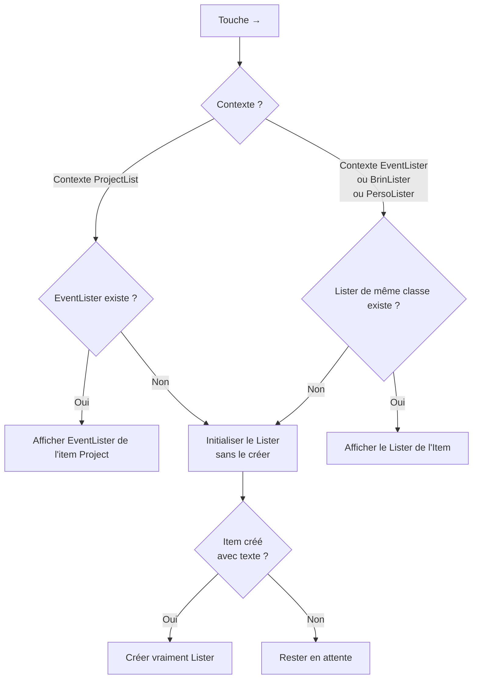

#  Eventer(3)

[TOC]

---

## Specs

### `Lister` et `Item`

`Lister` et `Item` sont à la base de tout dans l’application. Il suffit de bien décrire leur comportement pour gérer l’ensemble des types d’éléments, *projets*, *évènemenciers*, *brins* et *personnages* (pour le moment). Mais ce sont **des classes abstraites** dont vont hériter les autres classes.

IL EST CAPITALE DE BIEN COMPRENDRE CE QUI EST DIT CI-DESSUS, que **`Lister`** et **`Item`** sont ***le cœur*** et que tout le reste n'est que classes spécialisées.

* La *liste des projets* (`ProjectLister`) affichée au lancement de l’application est une classe spécialisée de `Lister` (`ProjectLister`) qui affiche les projets au départ.

  Chaque projet (`Project`) est une classe spécialisée de `Item` pour gérer chaque projet individuellement.

* Les évènemenciers (`EventLister`) est une classe spécialisée de `Lister` qui gère les évènemenciers (imbriqués ou non)

  Chaque évènemencier (`Event`) est une classe spécialisée de `Item` pour gérer chaque évènement (event).

* Les brins (`BrinLister`) est une classe spécialisée de `Lister` qui gère les brins (brins-groupe ou brins seuls)

  Chaque brin seul (ou brin-groupe) (`Brin`) est une classe spécialisée de `Item` pour gérer chaque brin.

* Les personnages (`PersoLister`) est une classe spécialisée de `Lister` qui gère les personnages (personnages-groupe ? ou personnages seuls)

  Chaque personnage seul (ou personnage-groupe ?) (`Brin`) est une classe spécialisée de `Item` pour gérer chaque personnage.

> Les brins-groupe et les personnages-groupe viennent simplement du fait que puisque toutes les listes peuvent être imbriquées, on peut avoir des imbrications aussi dans les brins et les personnages. Un brin ne serait pas un brin mais possèderait un lister de brins, donc deviendrait un « brin-groupe », par exemple le brin-groupe « Personnages » qui s’occuperait de chaque personnage — attention la confusion ici : aucun rapport entre ces personnages et les personnages de `PersoLister`).
>
> C’est plus difficile de l’imaginer pour les personnages, même si on pourrait très bien avoir un personnage-groupe « Protagonistes » avec tous les personnages qui aident le protagoniste, un personnage-groupe « Antagonistes » avec les antagonistes et un personnage-groupe « Ambivalents » avec ceux qui sont adjuvants et antagonistes.

TODO : Définir l’affichage propre à chaque type d’élément (note : c’est déjà fait dans le programme avec les projets).

##### Affichage

Sur une ligne

à gauche : `title` 

à droite : `badge`s des brins + `badge`s des persos à droite + menu `state`

#### Les brins

`BrinLister` < `Lister`

`Brin` < `Item`

#### Les personnages

`PersoLister` < `Lister`

`Perso` < `Item`

---

### `Lister`

~~~mermaid
classDiagram
	class Lister {
		+string id
		+boolean active
		+string type (todo: changer pour "mode")
		// Parmi "project", "event", "script", "brin", "mode"
		+string nature // parmi 'roman', 'film', 'none'
		+Scale scale
		+string[] item_ids
		+string[] brin_ids
		+string[] perso_ids
		+Options options // OU flags
		+Integer flags // OU options
		+string path
		+Date created_at
		+Date updated_at
	}
	
	class Options {
		+boolean colorizeItemsWithFirstBrin // <= SUPPRIMER
		+string colorizeItemsWith // 'brin'/'climat'
	}
	
	class Scale {
		<<enumeration>>
		acte
		metasequence
		sequence
		scene
		scenebeat
		atom
		text
	}
	
	Lister --> Options
	Lister --> Scale
~~~

#### Notes sur les propriétés de Lister

`active` ne sert que pour les projets, pour les activer et les activer. Pour les autres *Lister*, ils sont toujours actifs

**`path`** est le chemin d’accès absolu au lister, pour le décrire plus précisément. 

ATTENTION : pour les *Lister* de type `project`, ça correspond au chemin d’accès au dossier principal du projet. Tous les autres `path` (de *Lister* ou d’*Item*) pourront être estimé par rapport à lui.

### Item

~~~
classDiagram
	class Item {
		+string id
		+string title
		+string lister_id
		+Type[] type
		+string color
		+boolean checked
		+number duration
		+string path
		+Date created_at
		+Date updated_at
	}
	
	class State {
    0 : "---"
    1 : "ébauche"
    2 : "développement"
    3 : "premier jet"
    4 : "réécriture"
    5 : "achèvement"
    6 : "à corriger"
    7 : "correction"
    8 : "à relire"
    9 : "achevé"
  }
	
	class BrinType {
			mint : "Intrigue principale"
			aint : "Intrigue amoureuse"
			// à poursuivre
	}

	class EventType {
			dia : "Dialogue"
			act : "Action"
			des : "Description"
	}
	
	class Fonction {
    // (valeurs preset + custom)
    pro		: "Protagoniste"
    ant		: "Antagoniste"
    adj		: "Adjuvant/allié"
    men		: "Mentor"
    spr		: "Sprechhund"
    // (à poursuivre)
	}
	
	class Effet {
		j: jour
		m: matin
		o: midi
		s: soir
		n: nuit
	}
	
	class Event {
		+EventType type
		+string meteo
		+Effet effet 
		+string dyndate
		+State state
		+boolean isScript // version finale
	}
	
	class Project {
		+State state	
	}
	
	class Perso {
		+PersoType type
		+string2 badge // caps
		+string patronyme
		+string avatar
		+Fonction fonction	
	}
	
	class PersoType {
		p: "Protagonistes, Adjuvant…"
		a: "Antagonistes"
		b: "Ambivalent"
	}
	
	class Brin {
		+BrinType type
		+string3 badge // caps	
	}
	

	Item --> Type
	Item --> Perso
	Perso --> Fonction
	Perso --> PersoType
	Event --> State
	Event --> EventType
  Item --> Brin
  Brin --> BrinType
	Item --> Project
	Project --> State
	Item --> Event 
	Event --> Effet
	

~~~

#### Notes sur les propriétés de Item

Voir les [erreurs fréquentes](Erreurs-frequentes.md)

**`id`** devra être le plus court possible : `b+x` pour les brins (`b1`, `b2` etc.), `c+x`  pour les personnages, `i+x` pour les items, `l+x` pour les listers, etc.

**`color`** est la couleur hexadécimale de fond de l’item (qui déterminera aussi une couleur de police adaptée). sera surtout utile pour les brins dans un premier temps, mais devra être applicable à toutes les autres classes (Projets, Personnages, etc.).

**`checked`** permet de cocher l’item (coche en regard à gauche du title de l’item). C’est une donnée persistante.

**`duration`** est la durée en secondes.

**`title`** pour les `Perso`s sert de « pseudo », c’est-à-dire la valeur par défaut pour l’affichage.

**`meteo`**. Donnée propre aux évènements qui permet de définir la météo, c’est-à-dire le temps particulier qu’il fait au moment de l’event, si cela doit joue. Fonctionne de paire avec l’`effet` pour produire par exemple une couleur de fond.

**`effet`**. Comme dans un intitulé de scénario, le « nuit » ou « jour », étendu à « matin », « midi », « soir ».

**`dyndate`**. La *date dynamique* pour pouvoir gérer les dates dans l’histoire. Permet de définir des dates comme « trois jours après l’explosion » ou « D1 + 10d ». À l’heure où ces lignes sont écrites, le format n’est pas encore défini, mais il y a de fortes chances que ce soit défini par « D1 = 30/05/2026 » puis des choses comme `D1-10d` ou `explosion=29/05/2026` puis `explosion+2w` (pour « deux semaines après l’explosion ».

---

## Les quatre Contextes Lister

Il n'existe que CINQ CONTEXTES LISTER dans Eventer. Tous les autres affichages sont des panneaux isolés.

| Contexte | Classe Lister | Classe Item | Description |
|----------|---------------|-------------|-------------|
| **c1** | `ProjectLister` | `Project` | La liste des projets (affiché au démarrage) |
| **c2** | `EventLister` | `Event` | Un évènemencier (liste d'évènements) |
| **c3** | `BrinLister` | `Brin` | Une liste de brins (intrigues) |
| **c4** | `PersoLister` | `Perso` | Une liste de personnages |
| **c5** | `ScriptLister` | `ScriptItem` | Le texte final, roman ou scénario. |

Chaque Contexte Lister est indissociable de sa classe Item : un `ProjectLister` contient exclusivement des `Project`, un `EventLister` exclusivement des `Event`, etc.

### Lister enfant d'un Item

Un `Item` peut posséder au plus UN Lister enfant (on peut penser aux Listers comme aux dossiers dans le Finder ; un dossier dans le Finder, évidemment, ne possède évidemment qu’une et une liste liste de fichiers/dosssiers). Ce Lister enfant est **toujours du même type que le contexte courant**, sauf pour c1 :

- Depuis **c1** (`ProjectLister`) → le Lister enfant est toujours un **`EventLister`** (c2). C'est l'évènemencier du projet.
- Depuis **c2** (`EventLister`) → le Lister enfant est toujours un **`EventLister`** (c2). Un acte contient des séquences, une séquence contient des scènes, etc. — à la discrétion de l'auteur.
- Depuis **c3** (`BrinLister`) → le Lister enfant est toujours un **`BrinLister`** (c3).
- Depuis **c4** (`PersoLister`) → le Lister enfant est toujours un **`PersoLister`** (c4).

### Contextes courants

Il y a **deux contextes principaux**  qui sont exclusifs (navigation principale) :
- c1 : ProjectLister (liste des projets)
- c2 : EventLister (un évènemencier quelconque)

> On pourrait aussi ajouter le contexte **C5** du `ScriptLister` du mode final d’écriture.

Et il y a **deux contextes secondaires** (*panneaux qui s'ouvrent par-dessus un EventLister, liés à l'item sélectionné*) :
- c3 : BrinLister — les **brins** (aka intrigues) de cet Event précis
- c4 : PersoLister — les **persos** (aka personnages) de cet Event précis OU du brin (un personnage, de façon naturelle, appartient plutôt à un brin

> Bien noter que c3 et c4 ne sont pas des navigations indépendantes : ils sont relatifs au contexte c2 actif et à l'item qui y est sélectionné. L'EventLister (ou le ScriptLister) reste le contexte de fond.

---

## Architecture de persistance

*(rédigé à la base par ChatGPT d’après mon explication, puis arrangé conséquemment par moi)*

`Lister` et `Item` sont le cœur du système.

Un `Lister` contient des `Item`.
 Un `Item` peut lui-même posséder un `Lister` ou pas. Quand un Item possède un `Lister`, il possède un fichier `lof-<id item>.json` qui décrit son `Lister` (**`lof`** pour « lister of »).  Sinon, il ne possède pas ce fichier.

Depuis le 1er juin 2026, la persistance ne se fait plus en JSON mais dans une base de données SQLite (cf. [Schémas SQLite](Schema-SQLite.md)).

Note importante : l’ordre des items N’EST PAS maintenu par une propriété `position` ou autre, mais dans la données `item_ids` du Lister (cf. [Gestion de l’ordre](#gestion-ordre) ci-dessous).

Le chemin de persistance doit toujours être résolu à partir :

- du contexte courant ;
- du lister actif ;
- et de la hiérarchie runtime réelle.

---

## Lister - Gestion de l’ordre

L’ordre des items d’un Lister se gère exclusivement dans la propriété `item_ids` des data du Lister.

### Différer l’enregistrement en cas de déplacement

Pour ne pas multiplier les enregistrement massif **en cas de déplacement en rafale** des items, on différera l’enregistrement persistant des items.

---

## Lister - Options

La propriété `flags` persiste les options des Lister. 

Question : faut-il des options différentes pour chaque type de Lister ?

Pour le moment, on a seulement :

- mode d’affichage du fond des events dans un EventLister : soit la couleur du premier brin (ou pas de couleur), soit le « climat » de l’event qui est composé de la `meteo` et de l’`effet` (avec par défaut un temps clément de jour).

---

### Interactions

Voir [Interactions dans les Specs](Specs-general.md#interactions).

---

## Fonctionnement spécial de la création

Il faut bien comprendre le fonctionnement de la création des nouveaux éléments (Item) qui 

1) ne doivent jamais être créés tout de suite
2) crée des choses différentes en fonction de la classe spécialisée (`ProjectLister` avec items `Project`, `EventLister` avec items `Event`, `BrinLister` avec items `Brin`, `PersoLister` avec items `Perso`)

#### Propriétés éditées en fonction des classes spécialisées

*Une fois l’item mis en édition, la touche `Tab` doit permettre de passer de champ en champ pour les modifier avec le clavier.*

| Classe spécialisée | Liste des propriétés modifiables (Tab)                       |
| ------------------ | ------------------------------------------------------------ |
| `Project`          | `title` → `id`                                               |
| `Event`            | `title` → `state`                                            |
| `Brin`             | `title` → `badge` → `type` → `color`                         |
| `Perso`            | `title`  (pseudo) → `badge`  → `patronyme` → `type` → `fonction` |

### Création d’un nouveau projet

« n » dans le panneau de la liste des projets (contexte Lister `ProjectLister`) amorce la création d’un nouveau projet.

L’application ajoute un élément DOM, mais ne crée pas véritablement le projet.

Si on annule (Escape), on retourne à l’état précédent sans rien faire.
Si on tape `Enter` sur un texte vide, idem, on retourne à l’état précédent.
Si on tape un titre et qu’on fait `Enter` => Ça crée vraiment le projet (en cache et dans le finder). Donc, un enregistrement dans `/data/lof-projects/__items.json` et l’identifiant (défini par l’user à partir du titre) dans `item_ids` de `/data/lof-projects.json`.

### Création d’un nouvel évènemencier

Se fait en jouant la flèche `→` à partir d’un titre de projet OU d’un évènement (`Event < Item`) d’un évènemencier (`EventLister).

Voir ci-dessous [Fonctionnement spécial de « l’entrée dans »](#fonctionnement-entrer-dans).

### Création d’un nouvel évènement

*(donc dans un évènemencier affiché)*

« n » fonctionne de la même manière : 

On crée l’élément (Event) en mode édition, puis : 

SI on `Escape`, on supprime l’élément du DOM.
SI on ne tape aucun texte (`title`) et qu’on `Enter`, idem
SI on tape un `title` et qu’on `Enter` => on crée vraiment l’évènement (Item seulement bien entendu)

### Création d’un nouveau brin

Attention : un brin appartient toujours au projet (`Project < Item`) et jamais à rien d’autre (=> il faut toujours garder la trace de ce projet). Il est donc *toujours* enregistré dans `/data/lof-projects/lof-mon-id-projet/__brins.json).

Pour le reste, le fonctionnement est le même que pour le reste : pour que le brin soit réellement créé, il faut qu’il ait au moins un `title` (non vide).

### Création d’un nouveau personnage

Note importante : Contrairement à un *brin* (cf. ci-dessus), un personnage peut appartenir à n’importe quoi sauf à un personnage : un projet, un évènemencier ou un brin.

La place la plus logique d’un personnage est dans un brin. Quand le brin est sélectionné, dans sa fenêtre, la touche « p » permet de choisir/créer un personnage.

Pour le reste, le fonctionnement est le même que pour le reste : pour que le personnage soit réellement créé, il faut qu’il ait au moins un `title` (non vide) qui correspond à son *pseudo*.

---

### Édition des éléments

Chaque type d’Item a ses propres valeurs éditables (valeurs de base qu’on peut éditer avec `Enter`.

Quel que soit le cas, la première valeur est toujours `tittle` (qui est le pseudo pour les personnages.

| Type         | Édition                                                      |
| ------------ | ------------------------------------------------------------ |
| `Project`    | `title`  →  (custom) `id` Un premier ’id` est calculé automatiquement à partir du titre entré Un fois l’identifiant fixé, on ne le touche plus. |
| `Event`      | `title` → `state`                                            |
| `Brin`       | `title`  → `badge` (éditable, première version calculée d’après les trois premières lettres capitalisées du title) → `type` → `color` |
| `Perso`      | `title` →  `Patronyme` → `badge` (2 lettres majuscules max, première version proposée automatiquement par title) → `avatar` → `fonction` |
| `ScriptItem` | `title` (le texte) → `state` → `nature`                      |

---

## Type, nature, genre et mode

Une réflexion doit être menée concenant ces propriétés qui sont pour le moment utilisées un peu n’importe comment. On va essayer de faire une table pour rationnaliser ça.

|      Item | propriété   | Description et valeurs                                       |
| --------: | ----------- | ------------------------------------------------------------ |
|   `Event` |             |                                                              |
| `Project` | **`type`**  | Un projet ne peut-être que de deux types : scénario ou roman. Cela détermine comment sera traité le `ScriptLister` final. |
| Valeurs : |             | `scenario`, `roman`                                          |
|    `Brin` | **`type`**  | Un brin peut être de type « intrigue », « accessoire », « thématique », « personnage » en fonction de la chose sur laquelle il se focalise. Ces types sont consignés dans la constante `BrinTypes`. |
| Valeurs : |             | Cf. la constante `BrinTypes`                                 |
|   `Perso` | **`type`**  | Un personnage peut être de 3 types différents, du côté du protagonisme (type « prota », du côté de l’antagonisme (type « anta », ou ambivalent donc un peu les deux (type « ambi » ). |
|           | **`genre`** | Correspond vraiment au *genre*, donc femme, homme, non binaire ou autre. |
|           |             |                                                              |
|           |             |                                                              |
|           |             |                                                              |

---

## Niveaux d'imbrication de mode par niveau

Le *niveau d’imbrication* d’un item (pour le moment, seulement pour le `Item` de type `Event` dépend de sa profondeur à l’intérieur des `Lister`s du projet. Voilà ci-dessous un exemple de projet simple avec plusieurs imbrications :

~~~
		NIVEAU
			N1			N2		N3		N4

projet
	│
	├── Act 1
	│			│
	│			├── Seq 1.1
	│			│			│
	│			│			├── Scene 1.1.1
	│			│			│			│
	│			│			│			├── BScen 1.1.1.1
	│			│			│			└── BScen 1.1.1.2
	│			│			│			
	│			│			├── Scene 1.1.2
	│			│			└── Scene 1.1.3
	│			│
	│			├── Seq 1.2
	│			│			│
	│			│			└── Scene 1.2.1
	│			│
	│			├── Seq 1.3
	│			│			│
	│			│			├── Scene 1.3.1
	│			│			└── Scene 1.3.2
	│			│
	│			└── Seq 1.4
	│
	├── Act 2
	│			│
	│			├── Seq 2.1
	│			│			│
	│			│			└── Scene 2.1.1
	│			│
	│			└── Seq 2.2
	│			 			│
	│			 			└── Scene 2.2.1
	│
	├── Act 3
	│			│
	│			├── Seq 3.1
	│			│			│
	│			│			├── Scene 3.1.1
	│			│			└── Scene 3.1.2
	│			│
	│			├── Seq 3.2
	│			│
	│			├── Seq 3.3
	│			│			│
	│			│			└── Scene 3.2.1
	│			│
	│			├── Seq 3.4
	│			│
	│			├── Seq 3.5

~~~

On déduit de ce projet que : 

- tous les Actes (`Act x`) on un niveau d’imbrication de 1 (« premier niveau » d’imbrication)
- toutes les séquences (`sequence x.y`) ont un niveau d’imbrication de 2.
- tous les scènes (`scene x.y.z`) ont un niveau d’imbrication de 3.
- etc.

C’est simple comme ça parce qu’on a pris des noms évocateurs (acte, séquence, scène), mais on n’est obligé de rien dans ***Eventer***, on peut donc se retrouver avec des noms très différents de ceux-là.

#### Affichage normal (ou « par imbrication »)

Le mode d’affichage normal ou par imbrication fonctionne comme les dossiers et fichiers dans le Finder d’un Mac : on rentre dans un dossier et l’on voit ses éléments. Si un élément est un dossier, on peut alors entrer dedans de la même manière et l’on voit ses éléments.

> Dans Eventer, on « rentre dedans » avec la touche → comme cela est décrit dans la section [Fonctionnement spécial de « l’entrée dans »](#fonctionnement-entrer-dans).

#### Affichage en mode de niveau

Contrairement au mode d’affichage normal décrit ci-dessus, le l’affichage par mode de niveau (ou simplement ***affichage par niveau***) affiche l’intégralité des items s’un même niveau d’imbrication, avec la règle suivante : 

**RÈGLE : Si aucun item n’existe pour le niveau donné, c’est l’item du niveau supérieur (*) qui est affiché**

*(\*) donc de numéro d’imbrication inférieur.*

Cette règle est capitale pour que l’intégralité du projet soit représenté. 

> Une marque sur l’affichage de l’item indiquera cette exception (un signe particulier au début du nom.)

Par exemple, si nous reprenons le projet donné en exemple ci-dessus et que nous voulons afficher le Lister complet de niveau 3 (scène), nous obtiendrons la liste : 

~~~
Scene 1.1.1
Scene 1.1.2
Scene 1.1.3
Scene 1.2.1
Scene 1.2.1
Scene 1.3.2
+Seq 1.4
Scene 2.1.1
Scene 2.2.1
Scene 3.1.1
Scene 3.1.2
+Seq 3.2
Scene 3.2.1
+Seq 3.4
+Seq 3.5
~~~

#### Changement du mode d’affichage

On bascule d’un mode d’affichage à l’autre avec le raccourci ⌘ `m` (« m » comme « mode »).

Le mode est affiché en permanence dans la barre d’état en bas de fenêtre.

### Gestion de la profondeur

La facilité de l’affichage par niveau repose sur le fait que la profondeur (N1, N2, etc.) est persisté par la propriété `depth`.

Mais cette propriété a un cout : elle oblige à calculer cette profondeur `depth` à chaque changement de profondeur (ce qui peut arriver souvent en fonction de l’utilisation de l’Eventer.

1. `depth` doit devenir une propriété de `Lister` (table `listers`)

---

## Fonctionnement spécial de « l’entrée dans »

La fonction `EntrerDans` correspond à l’utilisation de la touche `→`. L’action est différente selon les contextes (LA liste des projets `ProjectLister`, UN évènemencier `EventLister`, UNE liste de brins `BrinLister` ou UNE Liste des personnages `PersoLister`).

---

## Propriétés

*(cette section essaie de rassembler les propriétés de chaque classe)*

### Propriétés communes à tous les Items

| Propriété   | Description                                                  | Valeurs |
| ----------- | ------------------------------------------------------------ | ------- |
| **`id`**    | Identifiant unique pour le projet. Custom pour les Project (en fonction du titre) et première lettre classe spécialisée + indice pour Perso, Brin et Event. |         |
| **`title`** | Toujours la valeur par défaut. Le titre du Project, le titre du Brin, le pseudo du personnage, le nom de l’Eventq. |         |
|             | qq                                                           |         |
|             |                                                              |         |

### Personnage / `Perso`

| **`avatar`**/`av`    | Emoji ou image                                               |      |
| -------------------- | ------------------------------------------------------------ | ---- |
| **`fonctions`**/`fn` | Fonctions du personnage. Liste de valeurs, avec des choix proposés et des valeurs custom possibles. |      |
|                      |                                                              |      |
|                      |                                                              |      |
|                      |                                                              |      |

